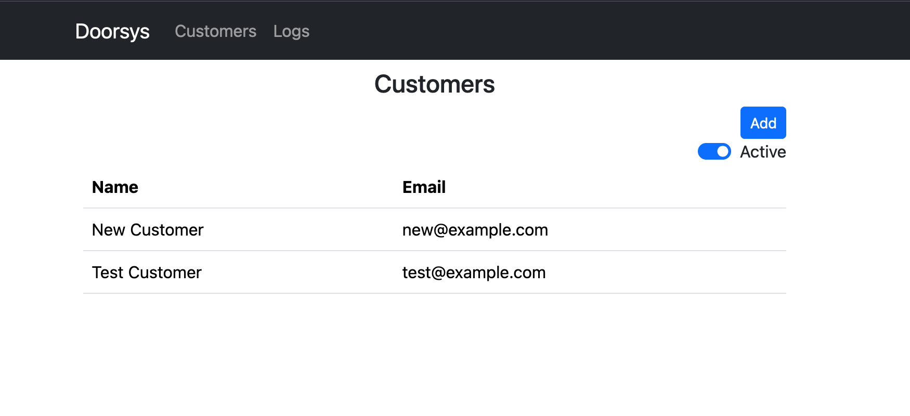

<!-- vim: set tw=80: -->

# Doorsys web

Administration console for the Doorsys platform. It provides an interface where
you can add and remove users, generate new pins, deactivate accounts or check
the audit logs.



## Project setup

```sh
npm install
```

### Compile and hot-reload for development

```sh
npm run dev
```

### Compile and minify for production

```sh
npm run build
```

### Lint with [ESLint](https://eslint.org/)

```sh
npm run lint
```
